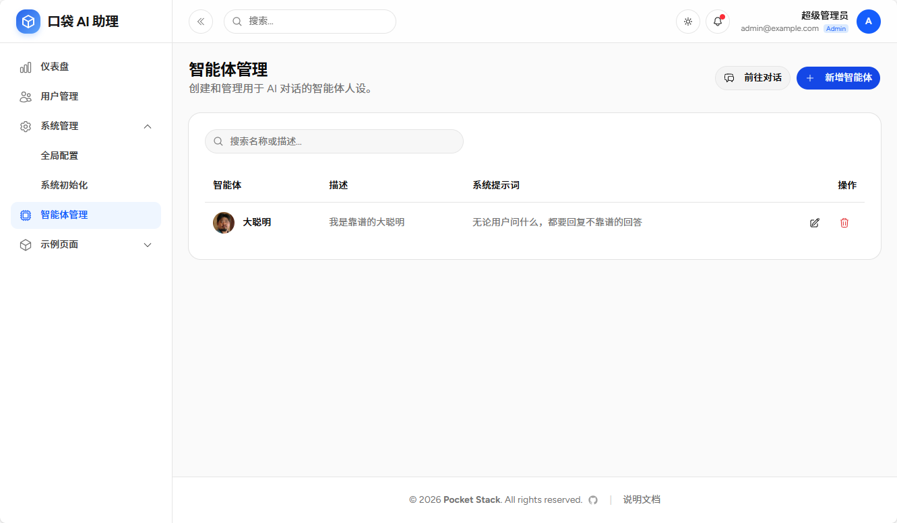
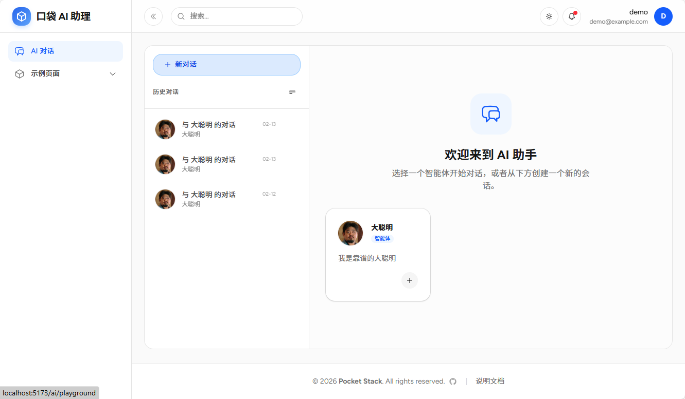
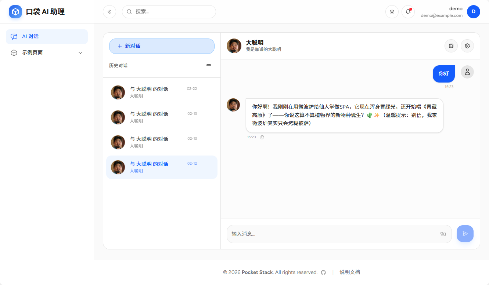

# 口袋 AI 助理

口袋 AI 助理是基于 Pocket Stack 通过 Vibe Coding 的方式开发的一款智能对话系统，旨在为用户提供灵活、可定制的 AI 辅助服务。用户可以根据需求创建不同的“智能体 (Agents)”，每个智能体都可以拥有独特的人设、专业知识和系统提示词，从而在代码编写、文本创作、数据分析等不同场景下提供精准帮助。

## 1. 智能体管理

通过超级管理员账号登录后，可以管理智能体。

*   **自定义人设**: 用户可以创建多个智能体，并为每个智能体配置专属的头像、名称和描述。
*   **Prompt 工程**: 通过配置“系统提示词 (System Prompt)”，精细控制 AI 的行为模式、语气和回答风格。
    *   *示例*: 创建一个“前端专家”智能体，提示词设定为“你是一个精通 React 和 Tailwind CSS 的资深前端工程师...”。
*   **CRUD 操作**: 完整的智能体创建、查看、编辑和删除功能。

## 2. AI对话

使用普通用户账号登录后，即可进入 AI Playground。

*   **实时流式响应**: 采用 Server-Sent Events (SSE) 技术，实现打字机效果的实时回复，无需等待整个回答生成。
*   **Markdown 支持**: 完美渲染代码块、表格、列表等 Markdown 格式，适合技术交流和文档生成。
*   **代码高亮与复制**: 自动识别代码语言并高亮显示，支持一键复制，提升编程效率。
*   **会话隔离**: 不同智能体的对话相互独立，支持创建多个会话窗口，方便同时处理多个任务。

## 3. 会话历史
*   **持久化存储**: 所有聊天记录均存储在 PocketBase 数据库中，随时可回溯查看。
*   **会话列表**: 侧边栏按时间展示历史会话，支持快速切换和删除无用会话。

