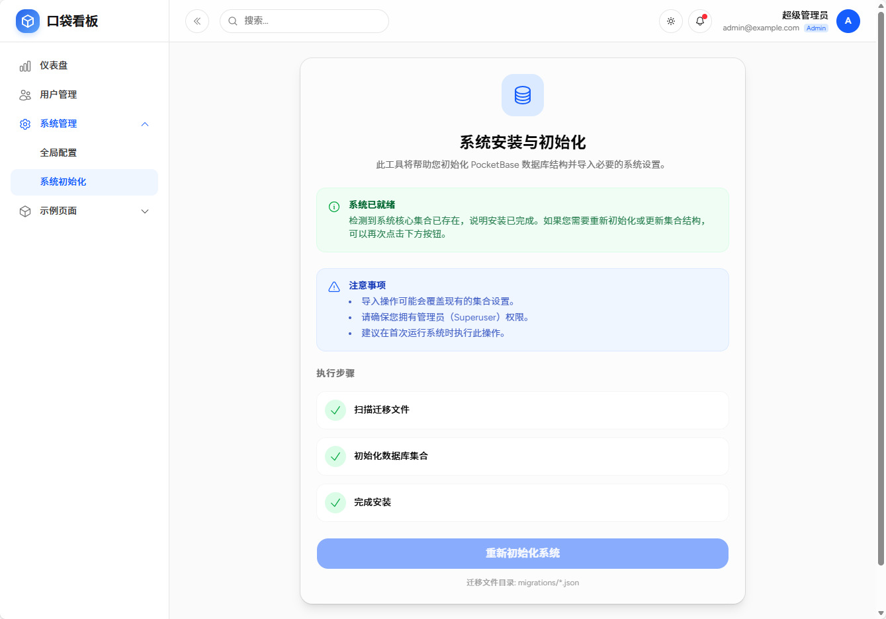

# 演示模块 (Demos) 安装与使用指南

Pocket Stack 提供了一系列演示模块，都是采用 `Vibe Coding`，在一天甚至更短时间内开发完成的。这些模块包括笔记、看板、AI对话助手、OKR等，可以独立部署，也可以集成到一个工程中。为了保持代码库的轻量和专注，这些模块并未直接包含在主分支 (`main`) 中，而是分布在独立的 `demo/*` 分支上。

你可以通过切换 Git 分支来体验不同的演示模块。

## 1. 可用演示模块

目前提供的演示模块包括：

| 模块名称           | 分支名 (`branch`) | 说明                                                  |
| :----------------- | :---------------- | :---------------------------------------------------- |
| **Notes (笔记)**   | `demo/notes`      | 类似 Google Keep 的笔记应用，支持标签、归档、回收站。 |
| **Kanban (看板)**  | `demo/kanban`     | 任务管理看板，支持拖拽排序、多列状态流转。            |
| **AI (对话助手)**  | `demo/ai`         | 集成大模型的对话助手，支持流式响应。                  |
| **OKR (目标管理)** | `demo/okr`        | 目标与关键结果管理系统，支持进度追踪。                |
| **NotebookLM**     | `demo/notebooklm` | 类似 Google NotebookLM 的文档问答与知识库系统。       |

## 2. 安装与切换步骤

### 2.1 克隆项目

首先，克隆 Pocket Stack 仓库到本地：

```bash
git clone https://github.com/citywill/pocket-stack.git
cd pocket-stack
```

### 2.2 切换分支

使用 `git checkout` 命令切换到你想要体验的模块分支。

**示例：切换到看板模块**

```bash
git checkout demo/kanban
```

### 2.3 安装依赖

切换分支后，由于不同模块可能依赖不同的第三方库，建议重新安装依赖：

```bash
npm install
```

### 2.4 启动项目

完成上述步骤后，启动开发服务器：

```bash
npm run dev
```

访问 `http://localhost:5173/` 即可体验当前模块的功能。

### 2.5 初始化项目

确保 PocketBase 服务已启动，并且数据库连接配置正确。

使用超级管理员账号登录系统后台，初始化系统数据库。


