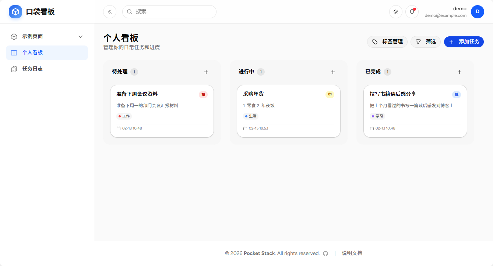
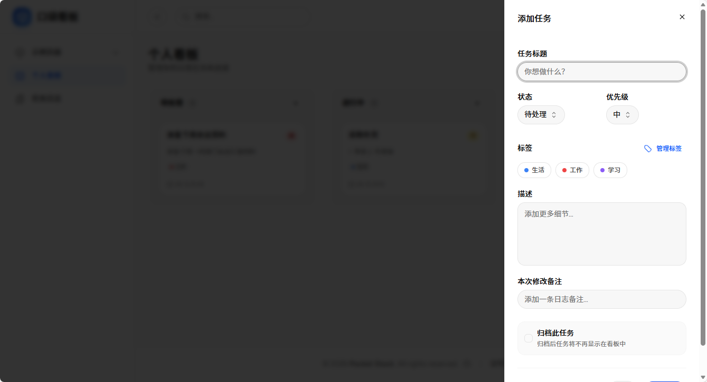
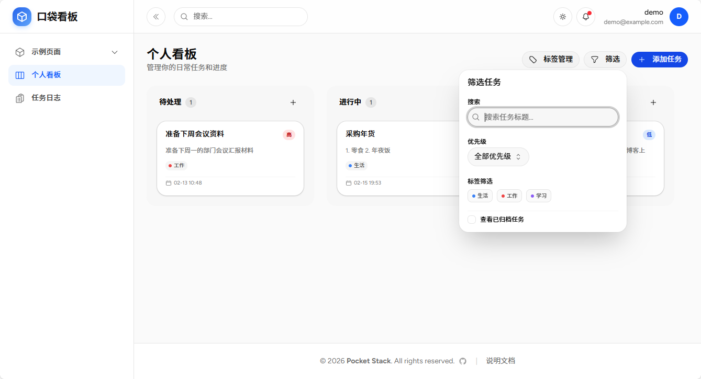
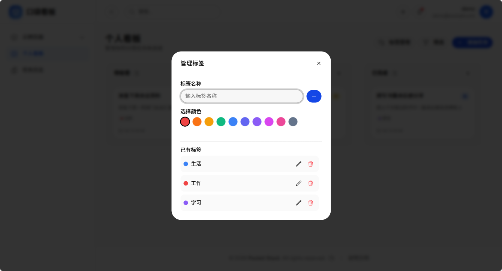
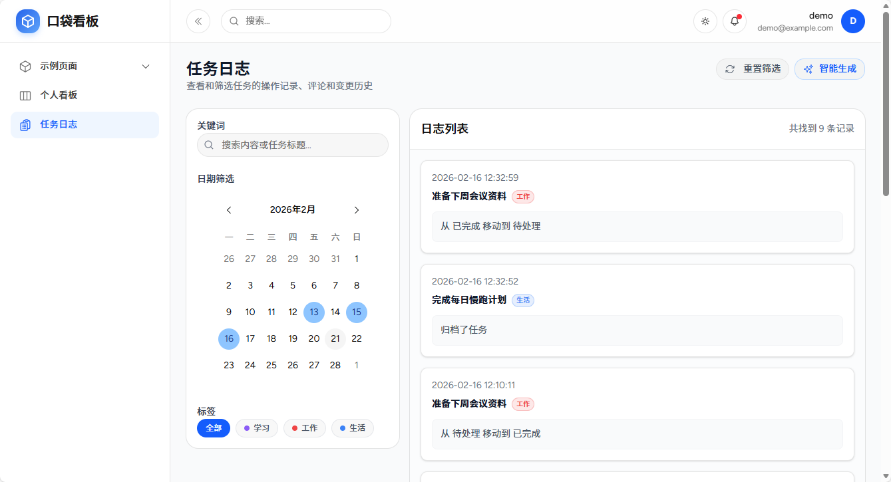
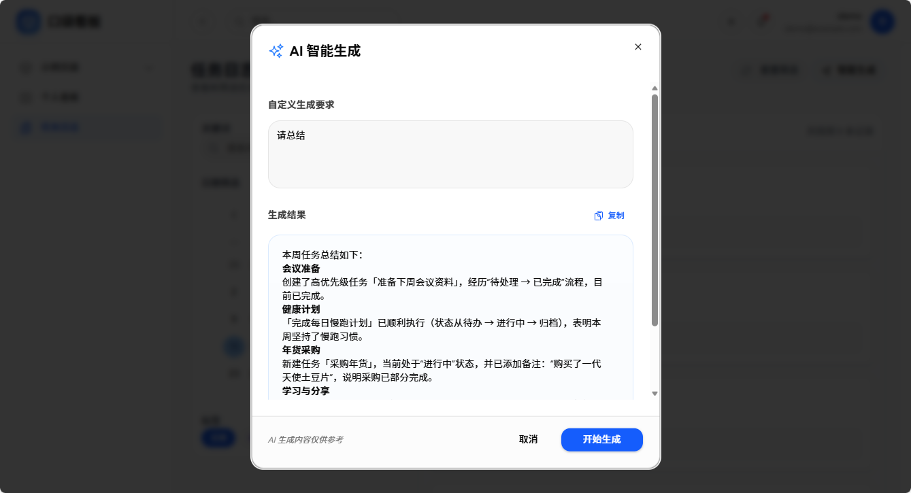

# 口袋看板

口袋看板是基于 `Pocket Stack` 通过 `Vibe Coding` 的方式开发的一款个人任务管理看板，提供个人任务管理和进度追踪功能。

## 1. 访问看板

访问 `/kanban` 路径，打开口袋看板页面，默认展示个人看板视图。

任务按状态分布在【待处理】、【进行中】、【已完成】三个列中，支持拖拽移动任务以更新状态。

---

## 2. 添加任务
点击右上角的【添加任务】按钮，可以创建新的任务卡片。

---

## 3. 筛选任务
点击【筛选】按钮，可以按标签或关键词筛选任务。

---

## 4. 标签管理
点击【标签管理】按钮，可以添加或编辑任务标签。

---

## 5. 任务日志

任务日志展示任务的状态变更历史，包括创建、状态变更、备注等操作。

## 6. 智能生成

智能生成功能基于任务日志上下文，根据用户要求生成如总结、计划等内容。

