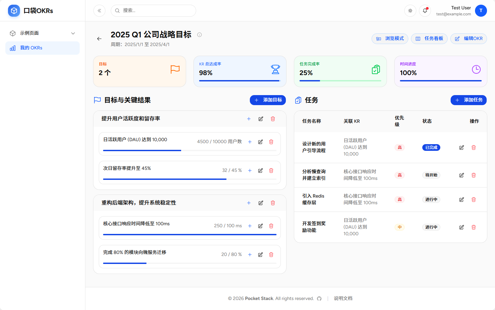
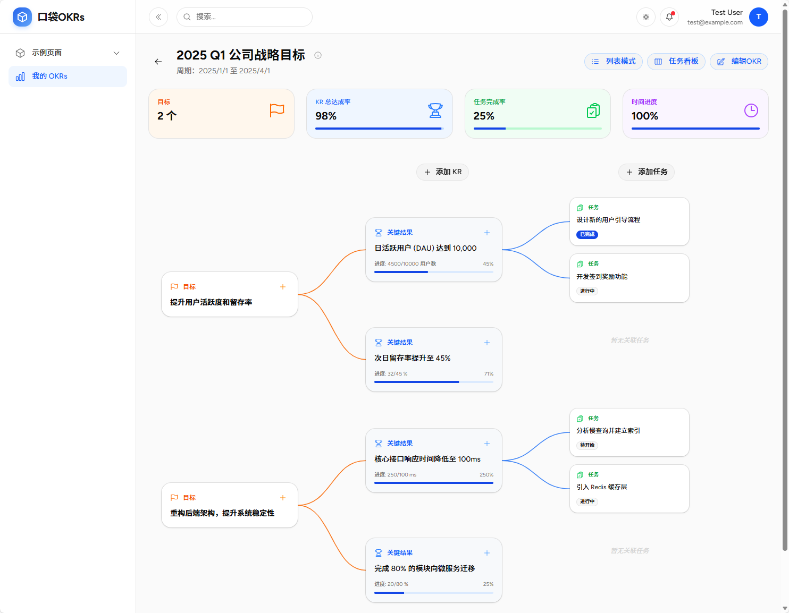
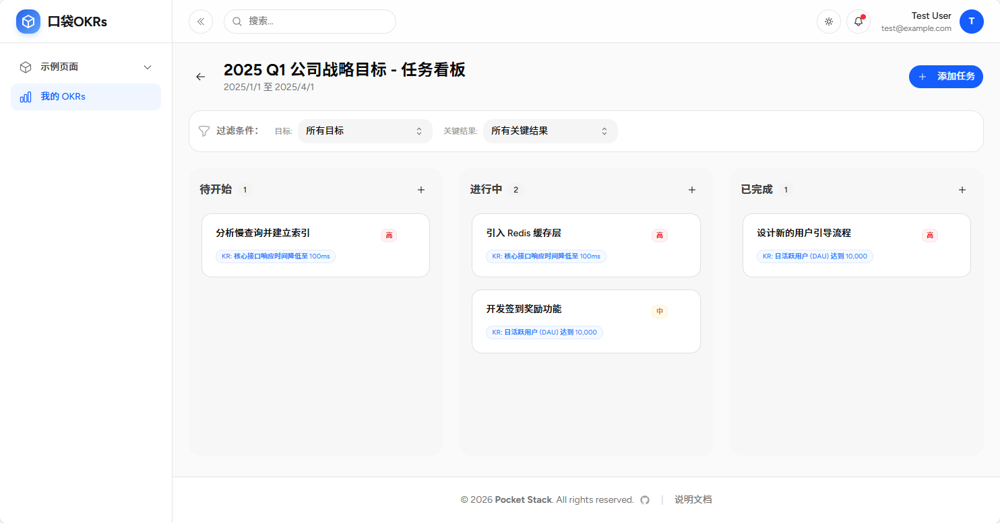

# 口袋 OKRs

## 简介
口袋 OKRs 是一个轻量级的目标管理工具，帮助个人或团队设定、跟踪和实现目标。它基于 OKR 方法论，将目标 (Objectives) 分解为关键结果 (Key Results)，并进一步细化为可执行的任务 (Tasks)。

## 核心概念

*   **Objective (目标)**: 你想要达成什么？（定性、鼓舞人心的目标）
*   **Key Result (关键结果)**: 如何衡量目标是否达成？（定量、可衡量的指标）
*   **Task (任务)**: 为了达成关键结果，具体需要做什么？（可执行的行动项）

## 功能特性

### 1. OKR 管理
*   **创建与编辑**: 快速创建 OKR，设定周期（如 2024 Q1）、起止时间和状态。
*   **状态追踪**: 支持“未开始”、“进行中”、“已完成”三种状态。
*   **进度概览**: 在列表中直观查看每个 OKR 的整体进度。

### 2. 目标对齐与分解
*   **多层级结构**: 支持 OKR -> Objective -> Key Result -> Task 的四层结构。
*   **可视化视图**:
    *   **列表视图**: 清晰展示层级关系，适合快速浏览和编辑。
    *   **树状视图**: 图形化展示目标分解路径，直观查看对齐情况。

### 3. 任务看板 (Task Board)
*   **看板管理**: 类似 Trello/Jira 的看板视图，管理任务流转。
*   **拖拽操作**: 支持拖拽任务在“待开始”、“进行中”、“已完成”之间流转。
*   **优先级管理**: 支持高、中、低优先级标记。
*   **筛选**: 支持按关联的 KR 筛选任务，专注于特定目标的执行。

## 使用指南

1.  **创建 OKR**: 在首页点击“新建 OKR”，填写名称、周期等信息。
2.  **添加目标 (Objective)**: 进入详情页，点击“添加目标”。
3.  **设定关键结果 (KR)**: 在目标下添加 KR，设定起始值和目标值（如从 0 到 100）。
4.  **分解任务**: 在看板或详情页中，为每个 KR 添加具体任务。
5.  **更新进度**:
    *   完成任务后，拖拽至“已完成”。
    *   定期更新 KR 的当前值，系统会自动计算进度。
