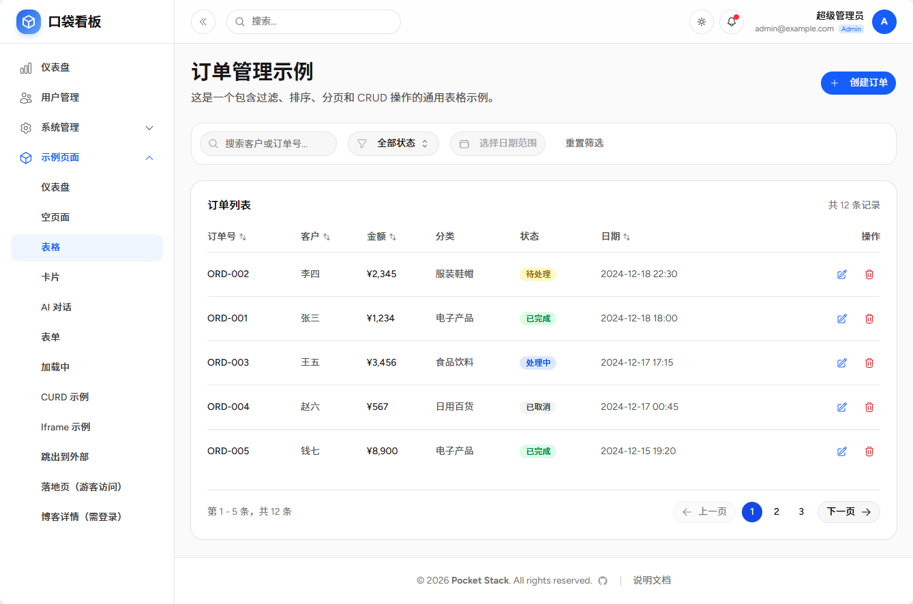
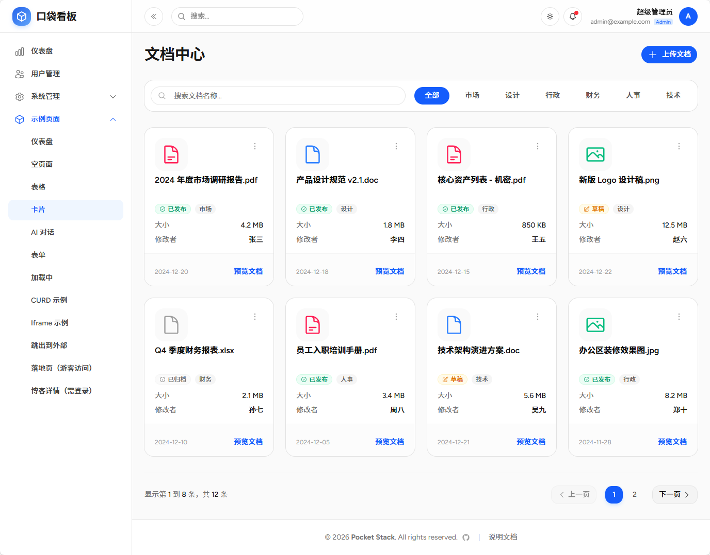
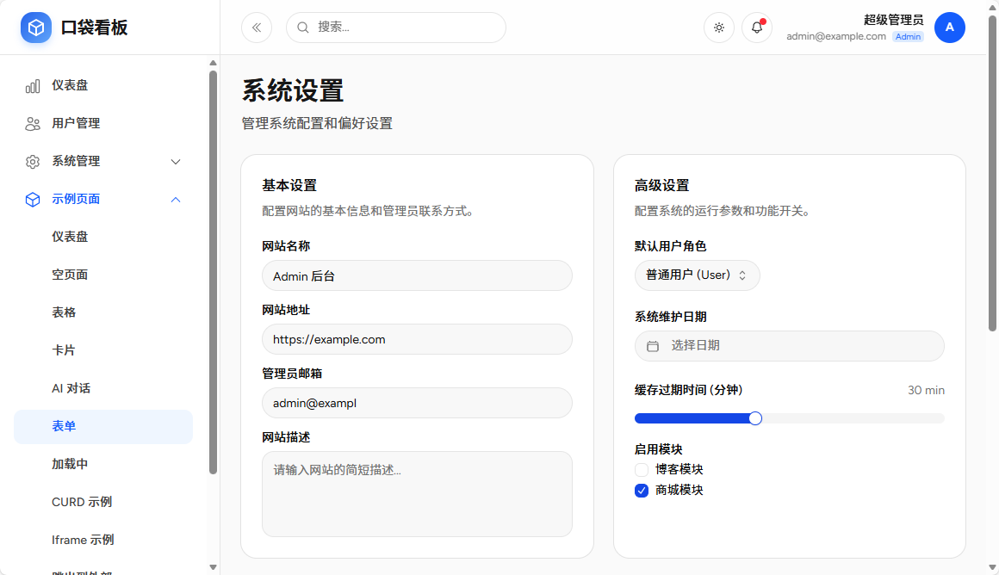
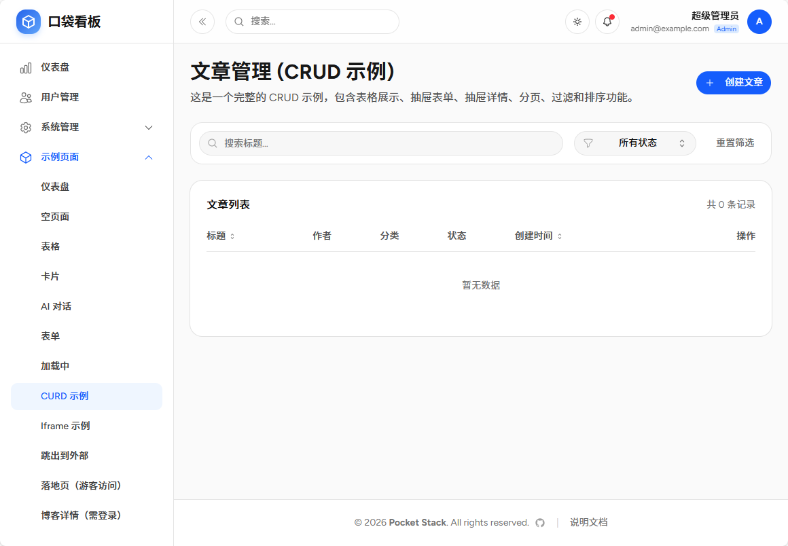
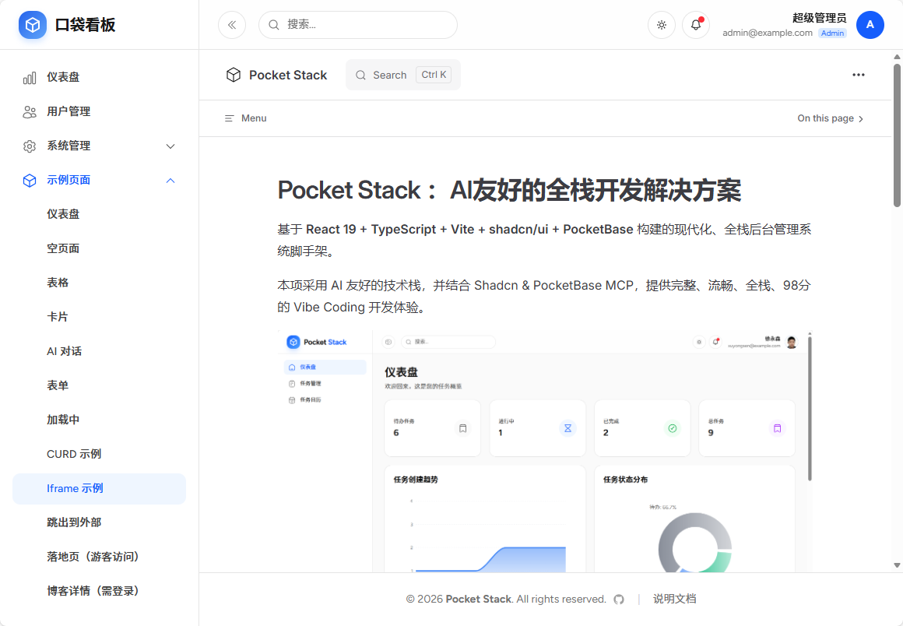
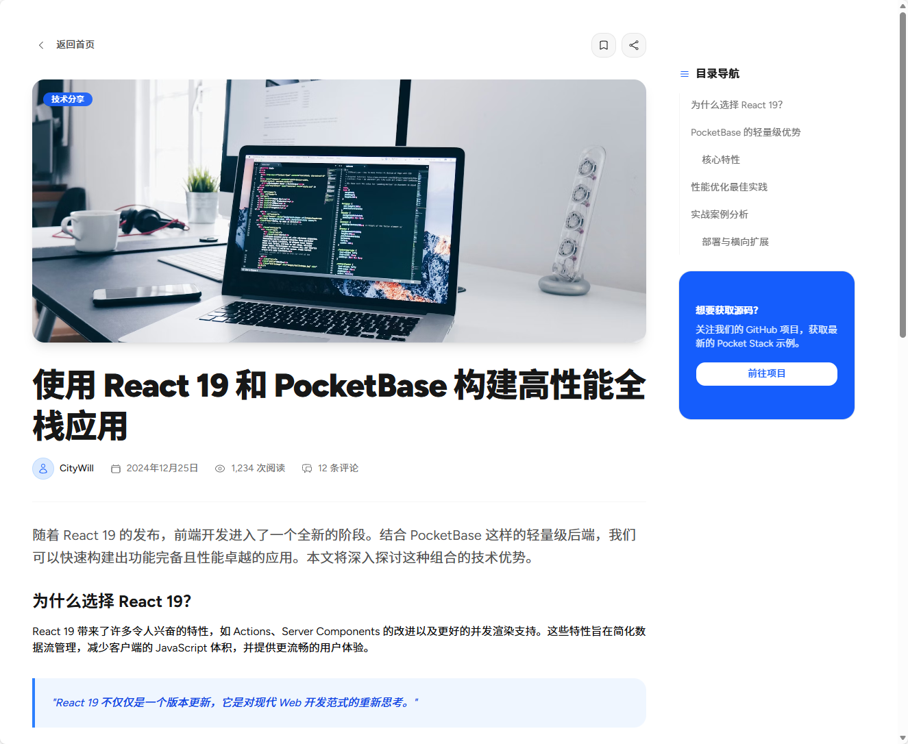

# 示例模块

示例模块展示了基于 Pocket Stack 框架开发的各类典型页面和功能组件。这些示例代码位于 `src/modules/examples` 目录下，可作为开发新功能的参考模板。

## 1. 仪表盘 (Dashboard)

展示了数据可视化页面的实现方式。

- **路径**: `/examples/dashboard`
- **文件**: [`src/modules/examples/Dashboard.tsx`](src/modules/examples/Dashboard.tsx)
- **主要功能**:
    - 集成 `recharts` 图表库。
    - 展示关键指标卡片（KPI Cards）。
    - 包含面积图（AreaChart）和饼图（PieChart）示例。
    - 响应式布局设计。


## 2. 表格示例 (Table)

展示了复杂数据表格的交互实现。

- **路径**: `/examples/table`
- **文件**: [`src/modules/examples/Table.tsx`](src/modules/examples/Table.tsx)
- **主要功能**:
    - 数据分页、排序和筛选。
    - 搜索功能集成。
    - 状态徽章（Badge）展示。
    - 包含新建、编辑、删除等操作按钮布局。
    - 使用 Dialog 和 Alert Dialog 进行交互确认。



## 3. 卡片列表 (Card)

展示了以卡片形式呈现数据的布局方式，适用于文档管理、商品展示等场景。

- **路径**: `/examples/card`
- **文件**: [`src/modules/examples/Card.tsx`](src/modules/examples/Card.tsx)
- **主要功能**:
    - 网格布局（Grid Layout）展示卡片。
    - 卡片包含图片、标题、元数据和操作菜单。
    - 支持下拉菜单操作。
    - 搜索和过滤工具栏。



## 4. 表单示例 (Form)

展示了系统设置类的表单页面布局。

- **路径**: `/examples/form`
- **文件**: [`src/modules/examples/Form.tsx`](src/modules/examples/Form.tsx)
- **主要功能**:
    - 标准表单布局。
    - 包含输入框、单选、多选、下拉选、日期、滑块、开关以及重置和提交按钮。
    - 分组卡片式表单设计。



## 5. AI 对话 (AI Chat)

展示了类似 ChatGPT 的对话界面实现。

- **路径**: `/examples/chat`
- **文件**: [`src/modules/examples/AiChat.tsx`](src/modules/examples/AiChat.tsx)
- **主要功能**:
    - 聊天消息列表自动滚动到底部。
    - 支持 Markdown 内容渲染（`react-markdown`）。
    - 模拟流式对话交互体验。
    - 输入框自动聚焦和发送处理。


## 6. CURD 示例 (CRUD Example)

展示了基于 PocketBase 后端的完整增删改查功能。

- **路径**: `/examples/curd`
- **文件**: [`src/modules/examples/curd/Index.tsx`](src/modules/examples/curd/Index.tsx)
- **主要功能**:
    - **后端集成**: 直接调用 PocketBase SDK 操作 `examples_posts` 集合。
    - **列表管理**: 服务端分页、搜索、状态过滤。
    - **抽屉表单**: 使用 Drawer 组件进行新建和编辑操作（`PostFormDrawer`）。
    - **详情查看**: 使用 Drawer 组件查看数据详情（`PostDetailDrawer`）。
    - **数据定义**: 包含 TypeScript 类型定义和迁移文件。



## 7. Iframe 集成

展示了如何在应用内嵌入外部网页。

- **路径**: `/examples/iframe`
- **文件**: [`src/modules/examples/IframePage.tsx`](src/modules/examples/IframePage.tsx)
- **主要功能**:
    - 全屏嵌入外部 URL。
    - 自适应高度布局。



## 8. 其他页面

- **空页面**: `/examples/blank` - 基础的页面骨架。
- **加载中**: `/examples/loading` - 加载状态演示。
- **外部链接**: 菜单支持配置外部链接跳转。
- **门户页面**:
    - 落地页: `/examples/portal/landing` (无后台布局)
    - 博客详情: `/examples/portal/blog-detail`





## 目录结构

```
src/modules/examples/
├── AiChat.tsx          # AI 对话
├── Blank.tsx           # 空页面
├── BlogDetail.tsx      # 博客详情
├── Card.tsx            # 卡片列表
├── Dashboard.tsx       # 仪表盘
├── Form.tsx            # 表单页
├── IframePage.tsx      # Iframe页
├── LandingPage.tsx     # 落地页
├── Loading.tsx         # 加载页
├── Table.tsx           # 表格页
├── curd/               # CURD 完整示例模块
│   ├── Index.tsx
│   ├── components/
│   ├── migrations/
│   └── types.ts
├── menu.ts             # 菜单配置
└── routes.tsx          # 路由配置
```
